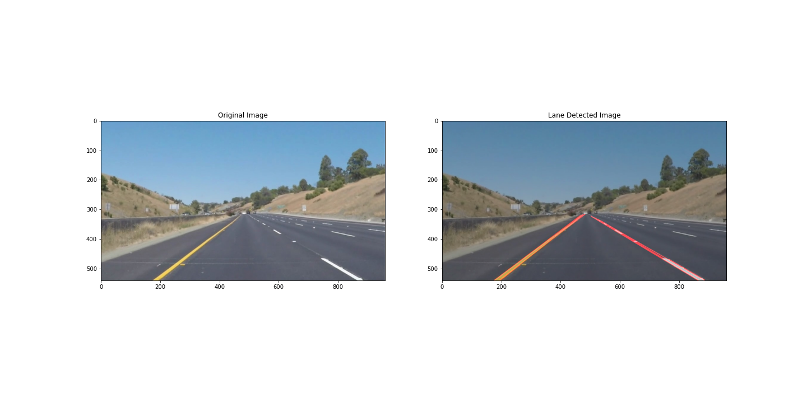
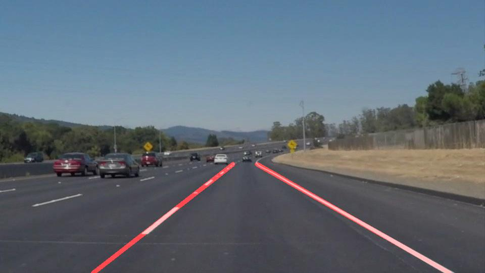
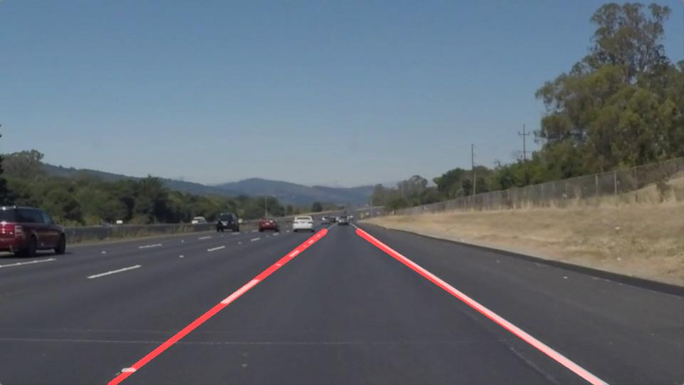
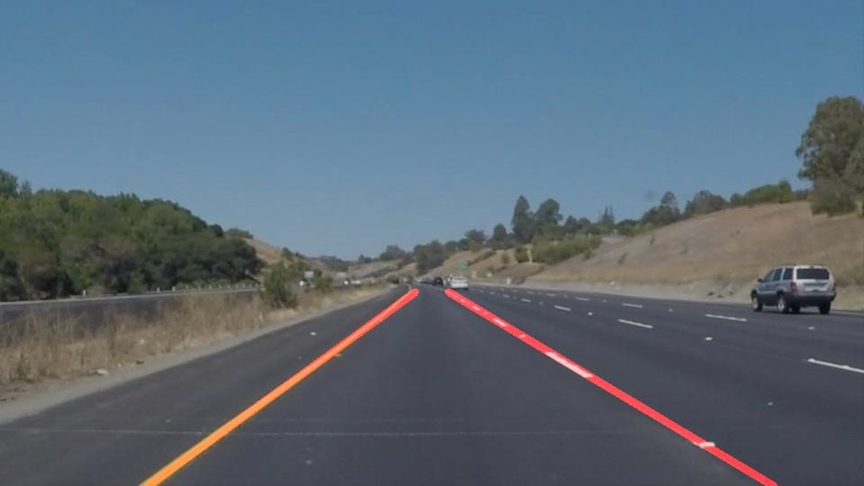
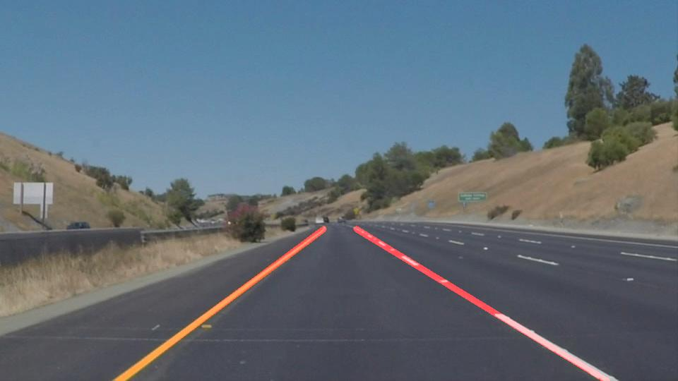
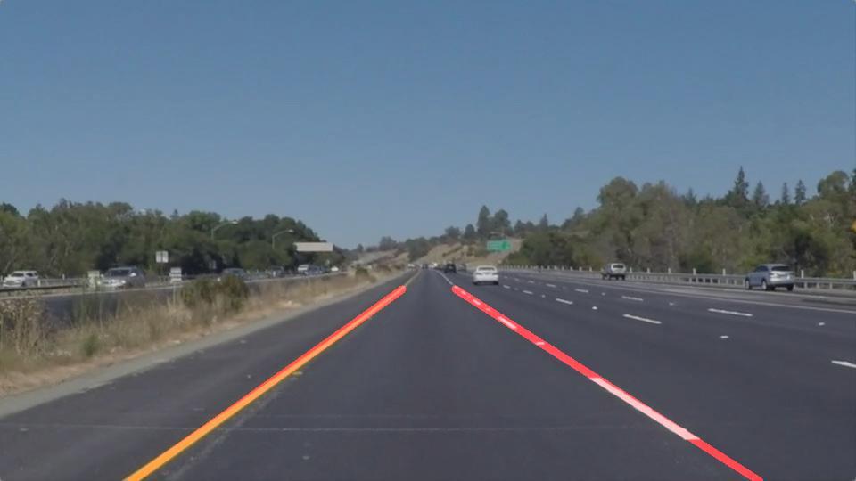
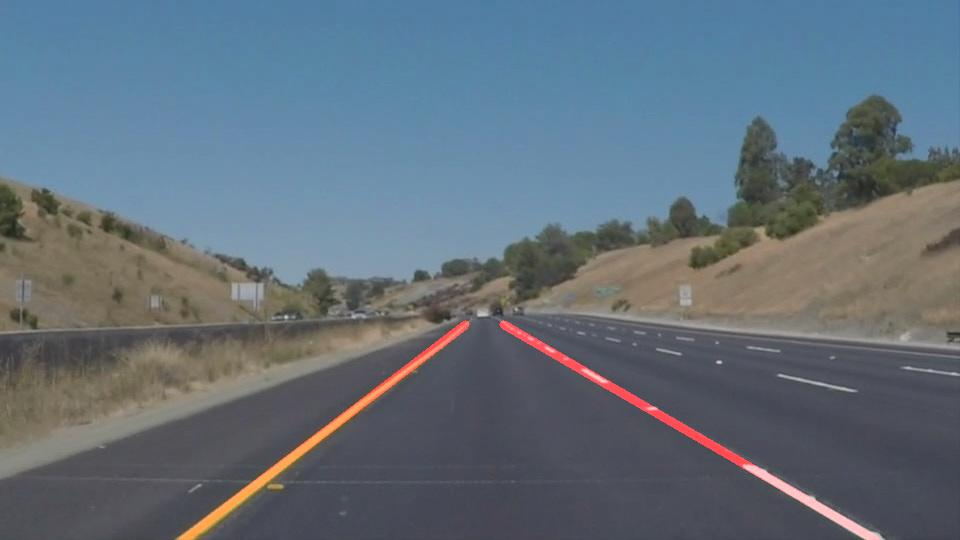

# **Finding Lanes Lines on the Road**

## Introduction
It is imporatant for a self driving car to stay in lane. To achieve this, it is important to identify the lanes efficiently and clearly. Since lanes can be of different colors (yellow and white) and forms (dashed, solid) it gets quite complicated to identify them efficiently. The lighing and the gradient of the roads adds to it complexity. However various mathematical models and alogirthms have been developed to extract lanes lines from a camera efficiently. In this project, a python program is computed to detect lane lines from camera images and further implemented on a video. Canny edge detection, Region Masking and Hough Transform are used to detect lanes. Shortcomings and improvements are also suggested

## Goals of the Project
The goals / steps of this project are the following:
* Make a pipeline that finds lane lines on the road
* Reflect on your work in a written report
* The processed image should look like:


## Reflection
### 1. Describe your pipeline. As part of the description, explain how you modified the draw_lines() function.
The pipeline has the following steps:
1. Import the image to be processed
2. Convert image to grayscale. This reduces the issue due to color and form.
3. Apply Gaussian smoothining. This suppress noises and all spruious gradients
4. Implement Canny edge detection algorithm. This identify the pixel poinst with the highest gradients (lane lines)
5. Focus on the region of interest using cv2.fillPoly. This masks out the surrouding and focus only on the area with the lane lines.
6. Apply Hough Transform to connect individual pixel points detected by Canny algorithm with lines.
7. Modify the draw_lines() to extend the lines from Hough transform over the entire lane
8. Overlap the developed lane line with the original image
9. Save the image 
10. Implement the pipeline over a video 

#### 1.1 Modification to draw_lines() function 
``` python
    x_leftline = []
    y_leftline = []
    x_rightline = []
    y_rightline = []
    imshape = image.shape
    ysize = imshape[0]
    ystart = int((3/5)*ysize) # selecting the end y coordinates for the line (y1(end),y2(start))
    yend = int(ysize) #  to caluclate the x cordinates once slope is measured
    
    for line in lines:
        for x1,y1,x2,y2 in line:
            slope = float(((y2-y1)/(x2-x1)))
            if (slope < -0.3): # Since the y axis is inversed in Open CV, left lines have a negavtive slope
                    x_leftline.append(x1)
                    x_leftline.append(x2)
                    y_leftline.append(y1)
                    y_leftline.append(y2)
            if (slope > 0.3): # Since the y axis is inversed in Open CV, left lines have a negavtive slope
                    x_rightline.append(x1)
                    x_rightline.append(x2)
                    y_rightline.append(y1)
                    y_rightline.append(y2)
    # Now construct the lines only when actual lines are detected
    if (x_leftline!=[]) and (x_rightline!=[]) and (y_leftline!=[]) and (y_rightline!=[]): 
        AB_leftline = np.polyfit(x_leftline, y_leftline, 1) ## Gives out the slope and intercept (y=Ax+B) for left lines constructed  
        xstart_left = int((ystart - AB_leftline[1])/AB_leftline[0])
        xend_left = int((yend - AB_leftline[1])/AB_leftline[0])
        AB_rightline = np.polyfit(x_rightline, y_rightline, 1) ## Gives out the slope and intercept (y=Ax+B) for right lines constructed
        xstart_right = int((ystart - AB_rightline[1])/AB_rightline[0])
        xend_right = int((yend - AB_rightline[1])/AB_rightline[0])
        cv2.line(img, (xstart_left, ystart), (xend_left, yend), color, thickness) ## Plot both the left and right lines on the image
        cv2.line(img, (xstart_right, ystart), (xend_right, yend), color, thickness)
```
The draw_lines() is defined as above. The left and right lines are  detected using the condition:
1. slope < -0.3 for the left lane
2. slope > 0.3 for right lane.

This discards all the flat lines achieveing a smooth lane line. The slopes are inverted as the yaxis is inverted in OpenCv. The start and end points for the y coordinates for the lanes lines to be generated are defined explicitly. Linear curve fitting is executed on the identified left and right lanes using polyfit() function. This function outputs the slope "A" and y intercept "B" in the line equation y=Ax+B. Using these coefficients the "x" cooridnates for the end and start points are calculated. 

Finally cv2.line() generates the full lane lines on both sides of the lane. This is merged with the orginal image for display.

#### 1.2 Pipepline executed on Test Images
1. Solid White Curve

2. Solid White Right

3. Solid Yellow Curve

4. Solid Yellow Curve 2

5. Solid Yellow Left

6. White Car Lane Switch


#### 1.3 Pipeline executed on Test Video
The vidoes are in my repo if you want to take look

## Shortcomings
1. Since i converet the image to grayscale, the effect of the environment was not considered. This includes lights and shadows. Hence the pipeline worked efficiently for the two test videos and failed for the challenge video
2. The top and end coordinates of the lane lines were explicilty defined. This worked fine for minimaL change in steering angle, but this could be inefficient during hard steering manuvers such as lane changes and right/left turns. This could be seen in the challenge video as well

## Possible Improvements
1. Alternative for grayscale conversion to include enevironments effects. 
2. Smoothen the lane line transition from one frame to the next by avaeraging the slopes for the identifies lane lines.
3. Machine learning can be used to make the pipeline for robust
