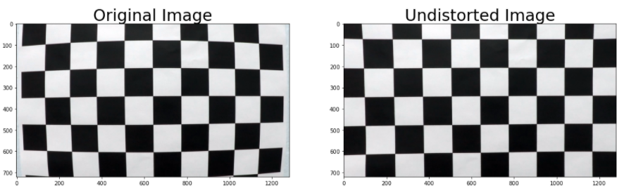
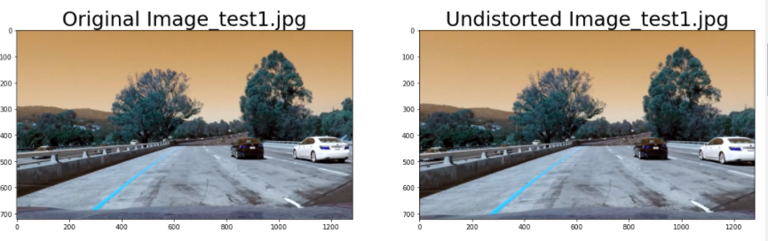
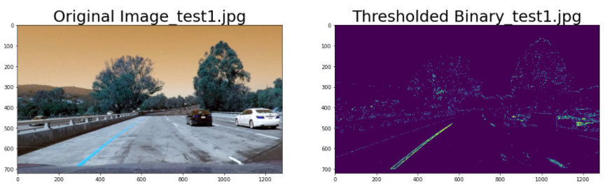
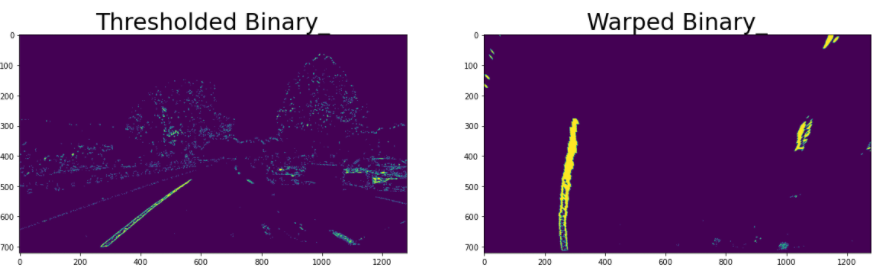
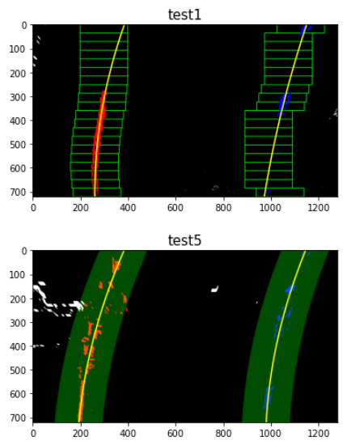
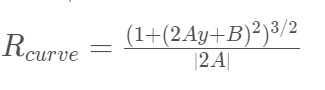
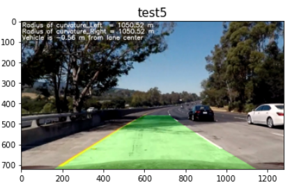

## Advanced Lane Finding
[](http://www.udacity.com/drive)

 
## Introduction
In this project, the primary goal is to develop a pipeline to identify the lane boundaries in a video. The video stream should be able to detect the lane boundaries along with the radius of curvature of the lane lines and vehicle position with respect to the centre of the lane.

The final image needs to look like this:


## Goals of the Project
The goals / steps of this project are the following:
* Compute the camera calibration matrix and distortion coefficients given a set of chessboard images.
* Apply a distortion correction to raw images.
* Use color transforms, gradients, etc., to create a thresholded binary image.
* Apply a perspective transform to rectify binary image ("birds-eye view").
* Detect lane pixels and fit to find the lane boundary.
* Determine the curvature of the lane and vehicle position with respect to center.
* Warp the detected lane boundaries back onto the original image.
* Output visual display of the lane boundaries and numerical estimation of lane curvature and vehicle position.


## Helper Functions
Detailed descrption of each function is mentioend in this section of the code. It mentions the inputs, the functioning and output of every function used in the code. Video_Processing.py python file is also imported to implement the pipeline defined in the helper functions on the video


## Reflection
### 1. Camera Calibration
The OpenCv functions cv2.findChessboardCorners(), cv2.drawChessboardCorners() and cv2.calibrateCamera() are used to calibrate the camera. The 20 images located in ./camera_cal are used as input for camera calibration.

cv2.findChessboardCorners() determines the input image as a view of the chessboard pattern and locates the internal chessboard corners. cv2.drawChessboardCorners() maps the individual chessboard corners.

The object points, which is the location of the chessboard corners in real world space is appended with positive corner detection with every image. The image points which is the pixel location is also appended. These image and object points are inputed in the function cal_undistort() to calibrate the camera using cv2.calibrateCamera(). The object and image points are appened in the function "camera_calibrate()"" in the code

cv2.calibrateCamera() returns the camera matrix (mtx) and distortion coefficients that is used for distortion correction of images in the function cv2.undistort(). These are defined in the function "cal_undistort()"
``` python
def cal_undistort(img, objpoints, imgpoints):
    # Calibrate the camera
    ret, mtx, dist, rvecs, tvecs = cv2.calibrateCamera(objpoints, imgpoints, img.shape[1::-1], None, None)
    
    # Undistort the Image
    dst = cv2.undistort(img, mtx, dist, None, mtx)
    return mtx, dist, dst
```

Example of Undistorted Camera Calibration Image:



### 2. Distortion Correction on Test Images
The above function "cal_undistort()" is used on the test images for distortion correction

Example of distortion correction on Raw Image:



### 3. Apply Color and Gradient Thresholds
The sobel operater in the X direction, the magnitude of the gradient and direction of the gardient is used to filter out pixels that aren't of interest. The RGB image is converted to HLS color space to apply color thresholding. The S channel is used to identify the lane lines. The final image is a binary image with all the combined color and gradient threshold.

Example of color and gradient threshold:



### 4. Perspective Transform
The perspective transform is used to obtain a bird's eye view of the camera view. cv2.getPerspectiveTransform() is used for this task. The input is the thresholded binary image

Example of prespective transform:



### 5. Identify Lane Lines and Fit polynomial
After calibration, thresholding & perspective transform, an binary image is obtained with lane lines clearly visible. However, the pixels part of the lane lines to the left and right needs to be identified individually

#### 5.1 Sliding Window Search
Computed the histogram for the bottom half of the image. Identified the base of the right and left lane lines as these correspond to the two local maxima in the histogram. Defined windows to identify lane pixels, centered on the midpoint of the pixels from the below window. Curve fit done to obtain the lane lines

#### 5.2 Curve Fit from Previous Frame
Performs the same function but uses information from previous curve fit of the lane lines. Uses the information stored in the class Line()

Example of identifying lane lines and curve-fit. First image uses the sliding window and second image uses curve fit from previous frame to find the lane boundaries




### 6. Calculate the Radius of Curvature & Vehicle Position
After the x position of the lane lines are interpolated,a  2nd order polynomial fit can be formed of the form Ay^2 + By + C for the two lanes.

The curvature of the lane lines are calculated using the below equation:



The A and B corresponds to the coefficients of the fit of the lane lines. But these are in unit pixels and hence needs to be converted into metric units

The conversion is done by modifying the coefficients as follows:

Before: Ay^2 + By + C

After: mx/(my^ 2)Ay^2 + (mx/my)By + C

where mx and my corresponds to the ratio of pixels to meter in the x and y direction.

The distance that the car is away from the center of the lane is calculated by subtracting the center of the two lanes from the center of the image. The result is in unit pixels and hence multiplied by the mx ratio mentioned above


### 7. Warp the Final Lane Boundaries on Original Image
After running the above algorithms on the image, the identified lane boundaries are warped onto the original image along with the radius of curvature for both lane lines and vehicle position from the centre of the lane.

Example of final outcome




### 8. Application on Video
The vidoes are in my repo if you want to take a look. Please open project_video_output to check the result. 

The algorithm works decent on the challenge video. But needs to be refined more. Please check challenge_video_output

The algorithm needs to be defninitely improved for the harder challenge. Refer harder_challenge_output

NOTE: Due to my busy schedule, i work as a vehicle controls engineer, i havent explored algorithm refinement for the challenge and harder challenge video. But i will definitely try some refinement techniques in the future


## Shortcomings
1. Using the algorithm on steep bends/curves. As seen in the harder_challenge video.
2. Detecting other vehicles and objects
3. Sometimes, the tree shadows caused the algorithm to fail

## Possible Improvements
1. Dynamic Thresholding 
2. Automating the parameter selection for binary thresholding, perspective transformation etc based on an optimiser
3. Machine learning can be used to make the pipeline for robust


## References 
* Advanced Lane Finding course material and quiz from the nanodegree program
* Stackoverflow
* Open source material on python and its various functions
