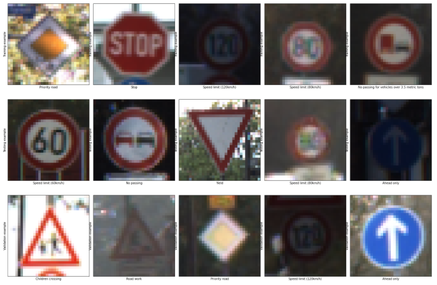
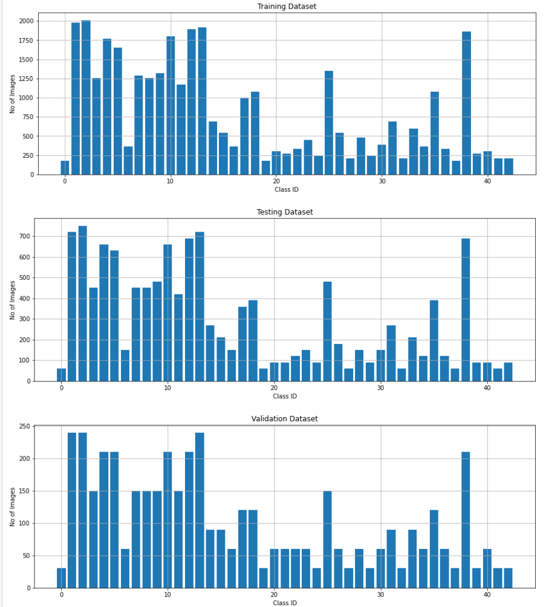
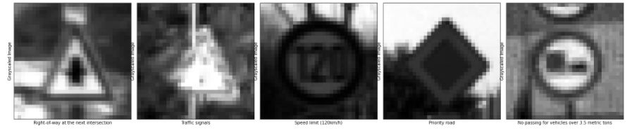
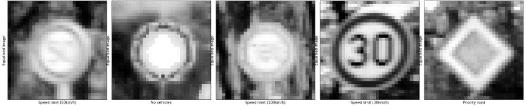
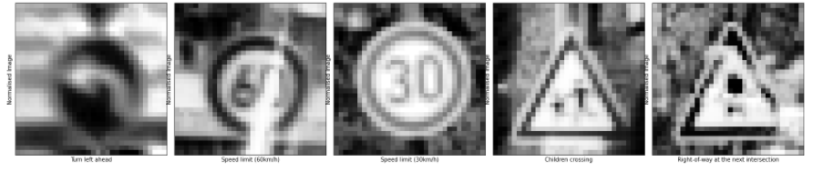
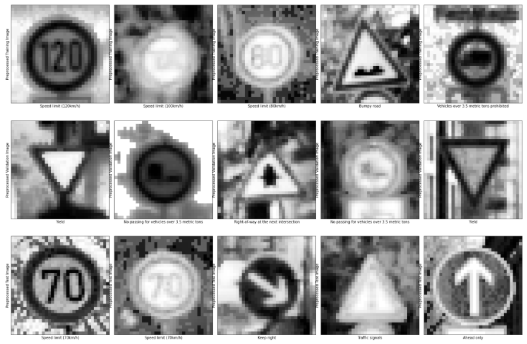
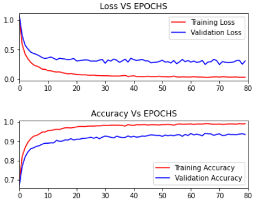
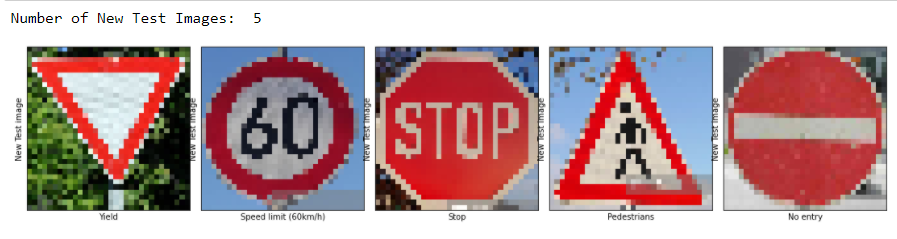
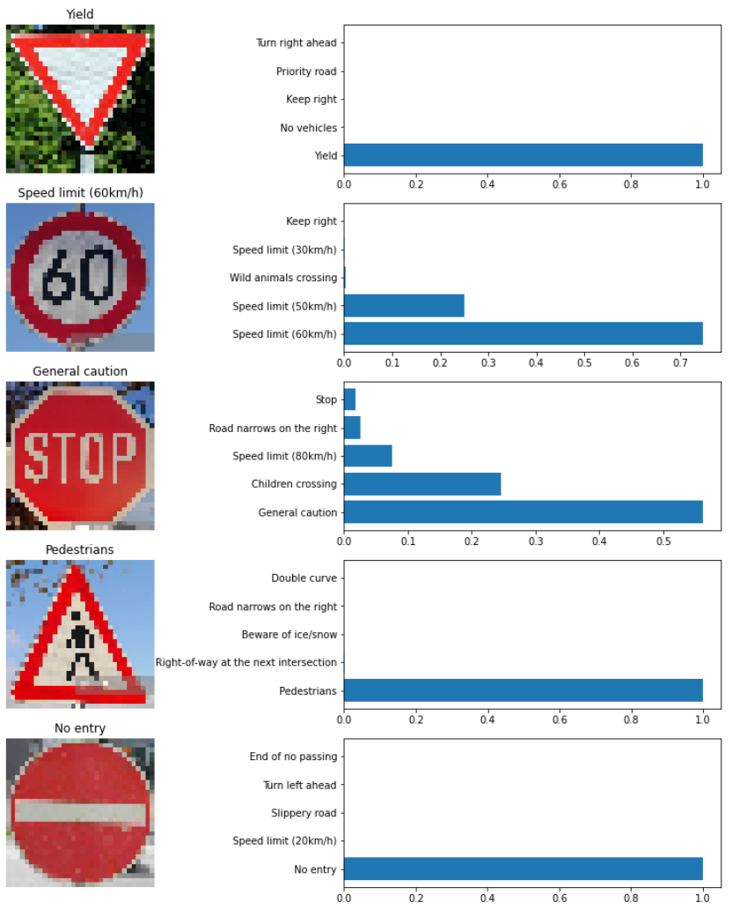

# **Traffic Sign Recognition** 
### Adarsh Raj

---

The goals / steps of this project are the following:
* Load the data set (see below for links to the project data set)
* Explore, summarize and visualize the data set
* Design, train and test a model architecture
* Use the model to make predictions on new images
* Analyze the softmax probabilities of the new images
* Summarize the results with a written report

[//]: # (Image References)

[image1]: ./examples/visualization.jpg "Visualization"
[image2]: ./examples/grayscale.jpg "Grayscaling"
[image3]: ./examples/random_noise.jpg "Random Noise"
[image4]: ./examples/placeholder.png "Traffic Sign 1"
[image5]: ./examples/placeholder.png "Traffic Sign 2"
[image6]: ./examples/placeholder.png "Traffic Sign 3"
[image7]: ./examples/placeholder.png "Traffic Sign 4"
[image8]: ./examples/placeholder.png "Traffic Sign 5"

## Rubric Points
### Here I will consider the [rubric points](https://review.udacity.com/#!/rubrics/481/view) individually and describe how I addressed each point in my implementation.  

---
### Writeup / README

#### 1. Provide a Writeup / README that includes all the rubric points and how you addressed each one. You can submit your writeup as markdown or pdf. You can use this template as a guide for writing the report. The submission includes the project code.

You're reading it! You are in the project that has all the codes, saved models and data used

### Data Set Summary & Exploration

#### 1. Provide a basic summary of the data set. In the code, the analysis should be done using python, numpy and/or pandas methods rather than hardcoding results manually.

I used the numpy library in python to calculate summary statistics of the traffic
signs data set:

* The size of training set is 34799
* The size of the validation set is 4410
* The size of test set is 12630
* The shape of a traffic sign image is (32, 32, 3)
* The number of unique classes/labels in the data set is 43

#### 2. Include an exploratory visualization of the dataset.

Here is an exploratory visualization of the data set. These are raw image files from the training, validation and testing dataset. 5 random images are picked.

A bar chart is also plotted for the training, validation & testing dataset. Here the distribution of images per class is plotted. A wide range of number of images per class in each dataset are present indicating pre processing techniques can be used to reduce disparity leading to improved performance

### Design and Test a Model Architecture

#### 1. Describe how you preprocessed the image data. What techniques were chosen and why did you choose these techniques? Consider including images showing the output of each preprocessing technique. Pre-processing refers to techniques such as converting to grayscale, normalization, etc. (OPTIONAL: As described in the "Stand Out Suggestions" part of the rubric, if you generated additional data for training, describe why you decided to generate additional data, how you generated the data, and provide example images of the additional data. Then describe the characteristics of the augmented training set like number of images in the set, number of images for each class, etc.)

The following preprocessing techniques are used. Each one is applied one after the other.

1. Shuffling: Shuffling is used to increase randomness and variety within the training set to increase stability of the CNN model. sklearn is used to shuffle the data

2. Graysclaing: This technique is used to improve the CNN accuracy. OpenCV is used to convert training images to greyscale

3. Local Histogram Equalisation: This technique is used to enhance images with low contrast. Since real world images are used in the training dataset, low contrast could cause irregularities in learning. Hence, this technique spreads out the most frequent intensity values in the image. skimage is ued to apply this technique
 

4. Normalization: This technique changes the range of the pixel intensity values. The data is normalized to have a uniform distribution with a mean of zero and equal variance. 

The final preproccesd images (random 5 images) for each dataset is shown below:

#### 2. Describe what your final model architecture looks like including model type, layers, layer sizes, connectivity, etc.) Consider including a diagram and/or table describing the final model.

My final model is a modified Lenet 5 architecture and consisted of the following layers:

| Layer         		|     Description	        					| 
|:---------------------:|:---------------------------------------------:| 
| Input         		| 32x32x1 preprocessed image   							| 
| Convolution 5x5     	| 1x1 stride, valid padding, outputs 28x28x6 	|
| RELU					|												|
| Max pooling	      	| 2x2 stride,  outputs 14x14x6 				|
| Convolution 5x5     	| 1x1 stride, valid padding, outputs 10x10x16 	|
| RELU					|												|
| Max pooling	      	| 2x2 stride,  outputs 5x5x16 				|
| Flatten					|					 Input: 5x5x16 -> Output: 400							|
| Dropout     | keep_prob = 0.8    |
| Fully connected    | Input: 400 -> Output: 120 |
| RELU					|												|
| Dropout     | keep_prob = 0.75    |
| Fully connected    | Input: 120 -> Ouput: 84 |
| RELU					|												|
| Fully connected    | Input: 84 -> Output: 43 |
 

#### 3. Describe how you trained your model. The discussion can include the type of optimizer, the batch size, number of epochs and any hyperparameters such as learning rate.

Adam optimizer is used to train the model. The final settings utilized for training are given below:

| Parameter        		|     Value        					| 
|:---------------------:|:-------------------------------------:| 
| Batch size         		| 125   							| 
| Epochs     	| 80 	|
| Learning rate					|		0.001										|
| Mean, mu	      	| 0 				|
| Variance, sigma     	| 0.1 	|
| Dropout keep probability | 0.80 (layer 1), 0.75 (layer 2)|

#### 4. Describe the approach taken for finding a solution and getting the validation set accuracy to be at least 0.93. Include in the discussion the results on the training, validation and test sets and where in the code these were calculated. Your approach may have been an iterative process, in which case, outline the steps you took to get to the final solution and why you chose those steps. Perhaps your solution involved an already well known implementation or architecture. In this case, discuss why you think the architecture is suitable for the current problem.

My final model results were:
* training set accuracy of 99.05%
* validation set accuracy of 93.46% 
* test set accuracy of 92.209%

The Lenet architecture implemented in the Lenet Lab was used as the starting point. With this model the validation accuracy was limited to 80-90%. Addtionaly, the loss and accuracy plots revealed overfitting. Two dropout layers were introduced to eliminate overfitting. The keep probabilites for both the layers were tuned by trial and error. Also EPOCHS and batch size were tuned by trial and error to achieve the required validation accuracy. The below plots of loss and accuracy indicate a smooth transition as the number of EPOCHS increases

The Lenet model is used, as the Lenet model for classifying characters are well documented. Traffic signs are simple shapes like characters, hence it is a good assumption that the Lenet model would perform well for classfiying traffic signs. This is verified by the final model results

### Test a Model on New Images

#### 1. Choose five German traffic signs found on the web and provide them in the report. For each image, discuss what quality or qualities might be difficult to classify.

Here are five German traffic signs that I found on the web:

The first and fourth image might be difficult to classify as they have the same shape

Similarily the second, thrid and fifth image. Moreover the second image is a speed limit sign. It might be more difficult as there are signs with more than one particualr speed limit.

#### 2. Discuss the model's predictions on these new traffic signs and compare the results to predicting on the test set. At a minimum, discuss what the predictions were, the accuracy on these new predictions, and compare the accuracy to the accuracy on the test set (OPTIONAL: Discuss the results in more detail as described in the "Stand Out Suggestions" part of the rubric).

Here are the results of the prediction:

| Image			        |     Prediction	        					| 
|:---------------------:|:---------------------------------------------:| 
| Yield      		| Yield   									| 
| Speed limit (60km/h)   			| Speed limit (60km/h)										|
| STOP				| General Caution											|
| Pedestrians	      		| Pedestrians					 				|
| No entry			| No entry      							|

The model was able to correctly guess 4 of the 5 traffic signs, which gives an accuracy of 80%.

#### 3. Describe how certain the model is when predicting on each of the five new images by looking at the softmax probabilities for each prediction. Provide the top 5 softmax probabilities for each image along with the sign type of each probability. (OPTIONAL: as described in the "Stand Out Suggestions" part of the rubric, visualizations can also be provided such as bar charts)

The code for making predictions on my final model is located in the 20th cell of the Ipython notebook.

For the first image, the model is sure that this is Yield sign (probability of 0.9999), and the image does contain a Yield sign. The top five soft max probabilities were

| Probability         	|     Prediction	        					| 
|:---------------------:|:---------------------------------------------:| 
| 0.9999        			| Yield 									| 
| 0.     				| No Vehicles									|
| 0.					| Keep right										|
| 0.	      			| Priority road		 				|
| 0.				    | Turn right ahead      							|

For the second image, the model is sure that this is Speed limit (60km/h) sign (probability of 0.75), and the image contains a Speed limit (60km/h) sign. The top five soft max probabilities were

| Probability         	|     Prediction	        					| 
|:---------------------:|:---------------------------------------------:| 
| .75         			| Speed limit (60km/h) 									| 
| .13    				| Speed limit (50km/h)										|
| .01					| Wild animals crossing										|
| .0	      			| Speed limit (30km/h) 	 				|
| .0				    | Keep right    							|

For the third image, the model is relatively sure that this is a General caution sign (probability of 0.60). However the image contains a stop sign. The top five soft max probabilities were

| Probability         	|     Prediction	        					| 
|:---------------------:|:---------------------------------------------:| 
| .60         			| General caution   									| 
| .25     				| Children crossing 										|
| .08					| Speed limit (80km/h)										|
| .03	      			| Road Narrows on the right				 				|
| .02				    | Keep right      			|

For the fourth image, the model is sure that this is a Pedestrian sign (probability of 0.9999), and the image contains a Pedestrian sign. The top five soft max probabilities were

| Probability         	|     Prediction	        			| 
|:---------------------:|:---------------------------------------------:| 
| .99999         			| Pedestrians   							| 
| .0     				| Right-of-way at the next intersection										|
| .0					| Beware of ice/snow								|
| .0	      			| Road narrows on the right				|
| .0				    | Double curve    	|

For the fifth image, the model is sure that this is a No entry sign (probability of 0.9999), and the image does contain a No entry sign. The top five soft max probabilities were

| Probability         	|     Prediction	        					| 
|:---------------------:|:---------------------------------------------:| 
| 0.9999       			| No entry 									| 
| .0    				| Speed limit(20km/h) 										|
| .0					| Slippery road										|
| .0	      			| Turn left ahead					 				|
| .0				    | End of no passing      							|

The results are shown below:

### (Optional) Visualizing the Neural Network (See Step 4 of the Ipython notebook for more details)
#### 1. Discuss the visual output of your trained network's feature maps. What characteristics did the neural network use to make classifications?

