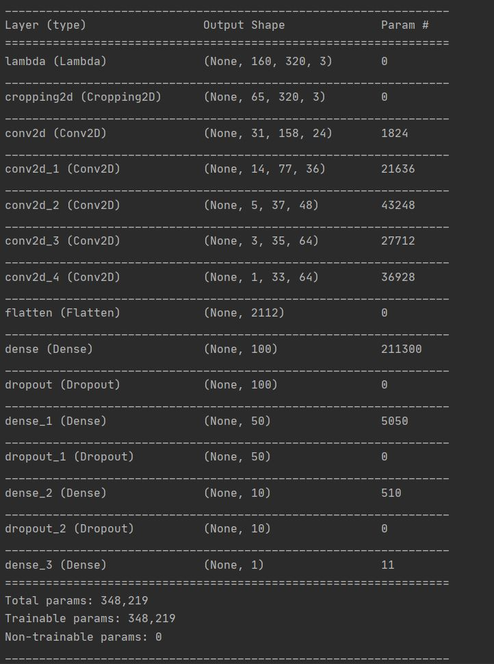

# **Behavioral Cloning** 
### Adarsh Raj
---

The goals / steps of this project are the following:
* Use the simulator to collect data of good driving behavior
* Build, a convolution neural network in Keras that predicts steering angles from images
* Train and validate the model with a training and validation set
* Test that the model successfully drives around track one without leaving the road
* Summarize the results with a written report

## Rubric Points
### Here I will consider the [rubric points](https://review.udacity.com/#!/rubrics/432/view) individually and describe how I addressed each point in my implementation.  

---
### Files Submitted & Code Quality

#### 1. Submission includes all required files and can be used to run the simulator in autonomous mode

My project includes the following files:
* model_class.py containing the script to create and train the model
* drive.py for driving the car in autonomous mode
* model.h5 containing a trained convolution neural network 
* writeup_report.md or writeup_report.pdf summarizing the results

#### 2. Submission includes functional code
Using the Udacity provided simulator and my drive.py file, the car can be driven autonomously around the track by executing 
```sh
python drive.py model.h5
```

#### 3. Submission code is usable and readable

The model.py file contains the code for training and saving the convolution neural network. The file shows the pipeline I used for training and validating the model, and it contains comments to explain how the code works.

### Model Architecture and Training Strategy

#### 1. An appropriate model architecture has been employed

My model consists of a convolution neural network with 2x2 filter sizes and depths between 24 and 64 (model_class.py lines 88-92) 

The model includes RELU layers to introduce nonlinearity (code line 88-92), and the data is normalized in the model using a Keras lambda layer (code line 85). 

#### 2. Attempts to reduce overfitting in the model

The model contains dropout layers in order to reduce overfitting (model_class.py lines 97-101). 

The model was trained and validated on different data sets to ensure that the model was not overfitting (code line 75-66). The model was tested by running it through the simulator and ensuring that the vehicle could stay on the track.

#### 3. Model parameter tuning

The model used an adam optimizer, so the learning rate was not tuned manually (model_class.py line 105).

#### 4. Appropriate training data

Training data privuided by Udacit was chosen to keep the vehicle driving on the road. It contains 9 laps of track 1 along with recivery data. Hence i thought this is good.

### Model Architecture and Training Strategy

#### 1. Solution Design Approach
The model used by the NVIDIA team for steering control of autonomousvehicle was used. This model has 5 convolutional layers and proven success in steeering control. I augmented the training data. The centre, left and right images was also used. Steering correction was also added. The validation data was split from the trainig data in the ratio 20% to 80%. Finally the simulator was used to see how well the car drove around the track. The vehicle did fall off the track with increased speed.

At the end, the vehicle is able to drive autonomously around the track with leaving the road.


#### 2. Final Model Architecture

The final model architecture (model_class.py lines 84-102) consisted of a convolution neural network with the following layers and layer sizes ...


